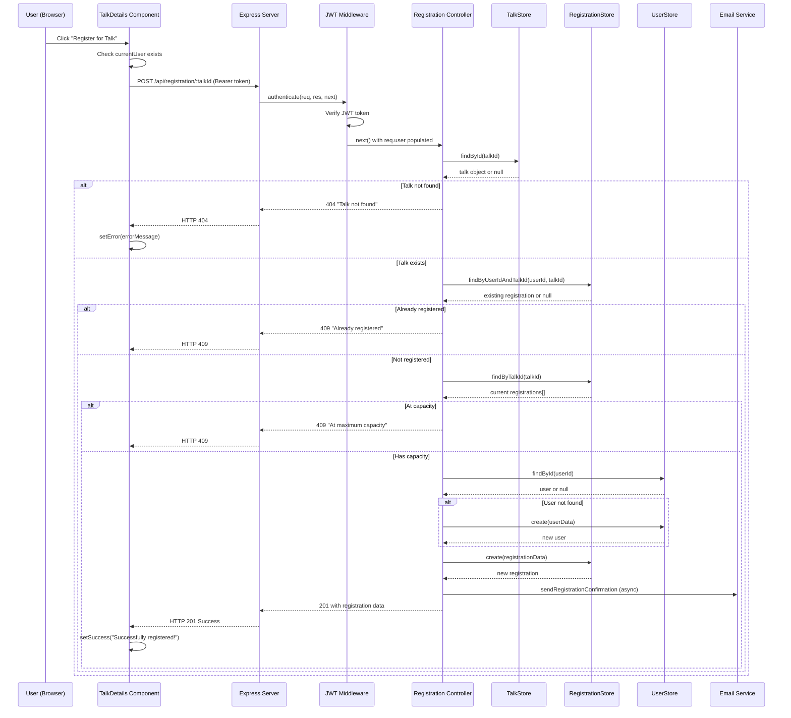

# DevOpsDay Medellin 2025 - End-to-End Workflow Documentation

**Auto-Detected Configuration:**
- PROJECT_TYPE: Node.js (with React frontend)
- ENTRY_POINT: API + Frontend
- PERSISTENCE_TYPE: File System (In-memory store)
- ARCHITECTURE_PATTERN: Layered
- WORKFLOW_COUNT: 3
- DETAIL_LEVEL: Implementation-Ready
- INCLUDE_SEQUENCE_DIAGRAM: true
- INCLUDE_TEST_PATTERNS: true

## Initial Detection Results

### Technology Stack Detected:
- **Backend**: Node.js with Express.js framework
- **Frontend**: React with Tailwind CSS
- **Authentication**: JWT-based authentication
- **Data Storage**: In-memory Map-based storage (TalkStore, RegistrationStore, UserStore)
- **Architecture**: Layered architecture with clear separation (Routes → Controllers → Store)
- **Key Dependencies**: axios, bcryptjs, jsonwebtoken, cors, nodemailer

### Entry Points Identified:
- **API Controllers**: `/api/talks`, `/api/auth`, `/api/registration`
- **Frontend Pages**: TalkDetails component, Calendar views
- **Service Layer**: talksService.js, authService integration

### Persistence Mechanisms:
- **File-based storage**: In-memory Map implementations
- **No external database**: Uses JavaScript Map for data persistence
- **Cross-reference relationships**: Registration links talks and users

---

## Workflow 1: Talk Registration End-to-End

### 1. Workflow Overview
**Name**: User Registration for Conference Talk  
**Business Purpose**: Allow authenticated users to register for specific DevOpsDay talks and receive confirmation  
**Triggering Event**: User clicks "Register for this Talk" button on talk details page  
**Files Involved**:
- Frontend: `client/src/pages/TalkDetails.js`, `client/src/services/talksService.js`
- Backend: `server/src/routes/registration.js`, `server/src/controllers/registration.js`, `server/src/store/registrations.js`, `server/src/utils/jwtAuth.js`

### 2. Entry Point Implementation

#### Frontend Entry Point - TalkDetails Component
```javascript
// File: client/src/pages/TalkDetails.js
function TalkDetails() {
  const { id } = useParams();
  const navigate = useNavigate();
  const { currentUser } = useAuth();
  const [registering, setRegistering] = useState(false);

  const handleRegister = async () => {
    if (!currentUser) {
      navigate('/signin', { state: { from: `/talks/${id}` } });
      return;
    }
    
    try {
      setRegistering(true);
      setError('');
      setSuccess('');

      const authHeader = currentUser.token ? 'Bearer ' + currentUser.token : undefined;
      if (!authHeader) throw new Error('No authentication token found. Please sign in again.');

      const response = await axios.post(`/api/registration/${id}`, {}, {
        headers: { Authorization: authHeader }
      });

      setSuccess('Successfully registered for the talk!');
      setIsRegistered(true);
    } catch (error) {
      const errorMessage = error.response?.data?.message || 'Failed to register for talk';
      setError(errorMessage);
    } finally {
      setRegistering(false);
    }
  };

  return (
    // JSX with registration button
    <button 
      onClick={handleRegister}
      disabled={registering}
      className="bg-blue-600 text-black px-6 py-2 rounded-md hover:bg-blue-700 disabled:opacity-50"
    >
      {registering ? 'Processing...' : 'Register for this Talk'}
    </button>
  );
}
```

#### API Entry Point - Registration Route
```javascript
// File: server/src/routes/registration.js
const express = require('express');
const router = express.Router();
const registrationController = require('../controllers/registration');
const { authenticate, isAdmin } = require('../utils/jwtAuth');

// All registration routes require authentication
router.use(authenticate);

// Register for a talk
router.post('/:talkId', registrationController.registerForTalk);
```

### 3. Service Layer Implementation

#### Authentication Middleware
```javascript
// File: server/src/utils/jwtAuth.js
const jwt = require('jsonwebtoken');

const authenticate = (req, res, next) => {
  try {
    const authHeader = req.headers.authorization;
    if (!authHeader || !authHeader.startsWith('Bearer ')) {
      return res.status(401).json({ message: 'No token provided' });
    }

    const token = authHeader.split(' ')[1];
    const decoded = jwt.verify(token, process.env.JWT_SECRET);
    req.user = decoded; // Contains user ID and other claims
    next();
  } catch (error) {
    return res.status(401).json({ message: 'Invalid token' });
  }
};
```

#### Registration Controller
```javascript
// File: server/src/controllers/registration.js
const registrationsStore = require('../store/registrations');
const talksStore = require('../store/talks');
const usersStore = require('../store/users');
const emailService = require('../services/email');

exports.registerForTalk = async (req, res) => {
  try {
    const { talkId } = req.params;
    const userId = req.user.id;

    // Auto-create user in usersStore if not found
    let user = usersStore.findById(userId);
    if (!user) {
      user = await usersStore.create({
        id: userId,
        displayName: req.user.displayName || req.user.name || 'Anonymous',
        email: req.user.email || '',
        company: req.user.company || '',
        jobTitle: req.user.jobTitle || ''
      });
    }

    // Check if talk exists
    const talk = talksStore.findById(talkId);
    if (!talk) {
      return res.status(404).json({ message: 'Talk not found' });
    }

    // Check if user is already registered
    const existingRegistration = registrationsStore.findByUserIdAndTalkId(userId, talkId);
    if (existingRegistration) {
      return res.status(409).json({ message: 'Already registered for this talk' });
    }

    // Check capacity constraints
    if (talk.maxAttendees) {
      const currentRegistrations = registrationsStore.findByTalkId(talkId);
      if (currentRegistrations.length >= talk.maxAttendees) {
        return res.status(409).json({ message: 'Talk is at maximum capacity' });
      }
    }

    // Create registration
    const registration = registrationsStore.create({
      userId,
      talkId,
      status: 'confirmed'
    });

    // Send confirmation email (async, don't wait)
    emailService.sendRegistrationConfirmation(user.email, talk, registration)
      .catch(error => console.error('Failed to send confirmation email:', error));

    res.status(201).json({ 
      message: 'Successfully registered for talk',
      registration: { ...registration, talk, user: { displayName: user.displayName, email: user.email } }
    });

  } catch (error) {
    console.error('Registration error:', error);
    res.status(500).json({ message: 'Internal server error', error: error.message });
  }
};
```

### 4. Data Mapping Patterns

No explicit DTOs are used; request/response objects are mapped directly:
```javascript
// Request: No body required, talkId from URL params, userId from JWT token
// Response mapping in controller:
const responseData = {
  message: 'Successfully registered for talk',
  registration: {
    ...registration,        // Registration data from store
    talk,                  // Enhanced with talk details
    user: {                // Enhanced with user details (filtered)
      displayName: user.displayName,
      email: user.email
    }
  }
};
```

### 5. Data Access Implementation

#### Registration Store
```javascript
// File: server/src/store/registrations.js
class RegistrationStore {
  constructor() {
    this.registrations = new Map();
    this.counter = 1;
  }

  create(registrationData) {
    const id = this.generateId();
    const timestamp = new Date();
    
    const registration = {
      id,
      ...registrationData,
      registeredAt: timestamp
    };

    this.registrations.set(id, registration);
    return registration;
  }

  findByUserIdAndTalkId(userId, talkId) {
    for (const registration of this.registrations.values()) {
      if (registration.userId === userId && registration.talkId === talkId) {
        return registration;
      }
    }
    return null;
  }

  findByTalkId(talkId) {
    const results = [];
    for (const registration of this.registrations.values()) {
      if (registration.talkId === talkId) {
        results.push(registration);
      }
    }
    return results;
  }
}
```

#### Talk Store Integration
```javascript
// File: server/src/store/talks.js
class TalkStore {
  findById(id) {
    return this.talks.get(id) || null;
  }

  findAll() {
    // Map 'id' to '_id' for frontend compatibility
    return Array.from(this.talks.values()).map(talk => ({
      ...talk,
      _id: talk.id
    }));
  }
}
```

### 6. Response Construction

```javascript
// Success Response (201 Created)
{
  "message": "Successfully registered for talk",
  "registration": {
    "id": "1",
    "userId": "user123",
    "talkId": "talk456",
    "status": "confirmed",
    "registeredAt": "2024-01-01T10:00:00.000Z",
    "talk": {
      "id": "talk456",
      "title": "Kubernetes at Scale",
      "startTime": "2025-05-22T11:30:00.000Z",
      "location": "Teatro Mayor San José"
    },
    "user": {
      "displayName": "John Doe",
      "email": "john@example.com"
    }
  }
}

// Error Responses
{
  "message": "Talk not found"                    // 404
  "message": "Already registered for this talk" // 409
  "message": "Talk is at maximum capacity"      // 409
  "message": "No token provided"                // 401
}
```

### 7. Error Handling Patterns

#### Controller Level Error Handling
```javascript
exports.registerForTalk = async (req, res) => {
  try {
    // Business logic here
  } catch (error) {
    console.error('Registration error:', error);
    res.status(500).json({ 
      message: 'Internal server error', 
      error: error.message 
    });
  }
};
```

#### Frontend Error Handling
```javascript
try {
  const response = await axios.post(`/api/registration/${id}`, {}, {
    headers: { Authorization: authHeader }
  });
  setSuccess('Successfully registered for the talk!');
} catch (error) {
  const errorMessage = error.response?.data?.message || 'Failed to register for talk';
  setError(errorMessage);
} finally {
  setRegistering(false);
}
```

### 8. Asynchronous Processing Patterns

```javascript
// Non-blocking email sending
emailService.sendRegistrationConfirmation(user.email, talk, registration)
  .catch(error => console.error('Failed to send confirmation email:', error));

// Frontend loading states
const [registering, setRegistering] = useState(false);
setRegistering(true);
// ... API call
setRegistering(false);
```

### 9. Testing Approach

#### Unit Test Structure (Controller)
```javascript
// File: server/src/controllers/__tests__/registration.test.js
const request = require('supertest');
const app = require('../../index');

describe('Registration Controller', () => {
  describe('POST /api/registration/:talkId', () => {
    it('should register user for talk successfully', async () => {
      const token = generateValidJWT({ id: 'user1', email: 'test@example.com' });
      
      const response = await request(app)
        .post('/api/registration/talk1')
        .set('Authorization', `Bearer ${token}`)
        .expect(201);

      expect(response.body.message).toBe('Successfully registered for talk');
      expect(response.body.registration.userId).toBe('user1');
    });

    it('should return 404 for non-existent talk', async () => {
      const token = generateValidJWT({ id: 'user1' });
      
      await request(app)
        .post('/api/registration/nonexistent')
        .set('Authorization', `Bearer ${token}`)
        .expect(404);
    });
  });
});
```

#### Frontend Component Test
```javascript
// File: client/src/pages/__tests__/TalkDetails.test.js
import { render, fireEvent, waitFor } from '@testing-library/react';
import axios from 'axios';
import TalkDetails from '../TalkDetails';

jest.mock('axios');

test('should register for talk when button clicked', async () => {
  const mockPost = axios.post.mockResolvedValue({ data: { message: 'Success' } });
  
  const { getByText } = render(<TalkDetails />);
  const registerButton = getByText('Register for this Talk');
  
  fireEvent.click(registerButton);
  
  await waitFor(() => {
    expect(mockPost).toHaveBeenCalledWith(
      '/api/registration/123',
      {},
      { headers: { Authorization: 'Bearer token123' } }
    );
  });
});
```

### 10. Sequence Diagram



---

## Workflow 2: Talk Retrieval and Display

### 1. Workflow Overview
**Name**: Fetch and Display Talk Details  
**Business Purpose**: Display comprehensive information about a specific DevOpsDay talk including speakers, schedule, and registration status  
**Triggering Event**: User navigates to `/talks/:id` route  
**Files Involved**:
- Frontend: `client/src/pages/TalkDetails.js`, `client/src/services/talksService.js`
- Backend: `server/src/routes/talks.js`, `server/src/controllers/talks.js`, `server/src/store/talks.js`

### 2. Entry Point Implementation

#### Frontend Entry Point
```javascript
// File: client/src/pages/TalkDetails.js
function TalkDetails() {
  const { id } = useParams();
  const { currentUser } = useAuth();
  const [talk, setTalk] = useState(null);
  const [isRegistered, setIsRegistered] = useState(false);
  const [loading, setLoading] = useState(true);

  useEffect(() => {
    const fetchTalkDetails = async () => {
      try {
        setLoading(true);
        const response = await axios.get(`/api/talks/${id}`);
        setTalk(response.data);
        
        // Check if user is registered for this talk
        if (currentUser && currentUser.token) {
          try {
            const authHeader = 'Bearer ' + currentUser.token;
            const registrationsResponse = await axios.get('/api/registration/user', {
              headers: { Authorization: authHeader }
            });
            
            const isUserRegistered = registrationsResponse.data.some(
              registration => registration.talk._id === id
            );
            setIsRegistered(isUserRegistered);
          } catch (error) {
            console.error('Error checking registration status:', error);
          }
        }
      } catch (error) {
        console.error('Error fetching talk details:', error);
        setError('Failed to load talk details. Please try again later.');
      } finally {
        setLoading(false);
      }
    };

    fetchTalkDetails();
  }, [id, currentUser]);
}
```

#### API Service Layer
```javascript
// File: client/src/services/talksService.js
import axios from 'axios';

const API_URL = process.env.REACT_APP_API_URL || '';

export const getTalkById = async (id) => {
  try {
    const response = await axios.get(`${API_URL}/api/talks/${id}`);
    return response.data;
  } catch (error) {
    console.error(`Error fetching talk with ID ${id}:`, error);
    throw error;
  }
};

export const getAllTalks = async () => {
  try {
    const response = await axios.get(`${API_URL}/api/talks`);
    return response.data;
  } catch (error) {
    console.error('Error fetching talks:', error);
    throw error;
  }
};
```

#### API Entry Point
```javascript
// File: server/src/routes/talks.js
const express = require('express');
const router = express.Router();
const talksController = require('../controllers/talks');

// Public routes
router.get('/', talksController.getAllTalks);
router.get('/:id', talksController.getTalkById);
```

### 3. Service Layer Implementation

#### Talks Controller
```javascript
// File: server/src/controllers/talks.js
const talksStore = require('../store/talks');

exports.getTalkById = (req, res) => {
  try {
    const talk = talksStore.findById(req.params.id);
    if (!talk) {
      return res.status(404).json({ message: 'Talk not found' });
    }
    res.status(200).json(talk);
  } catch (error) {
    res.status(500).json({ message: 'Error fetching talk', error: error.message });
  }
};

exports.getAllTalks = (req, res) => {
  try {
    const talks = talksStore.findAll();
    res.status(200).json(talks);
  } catch (error) {
    res.status(500).json({ message: 'Error fetching talks', error: error.message });
  }
};
```

### 4. Data Access Implementation

#### Talk Store with DevOpsDay Data
```javascript
// File: server/src/store/talks.js
class TalkStore {
  constructor() {
    this.talks = new Map();
    this.counter = 1;
  }

  findById(id) {
    return this.talks.get(id) || null;
  }

  findAll() {
    // Map 'id' to '_id' for frontend compatibility
    return Array.from(this.talks.values()).map(talk => ({
      ...talk,
      _id: talk.id
    }));
  }

  populateWithMockData() {
    const mockTalks = [
      {
        title: 'The Power of AI in Cloud Reliability Engineering (CRE)',
        description: 'Carlos Rojas, Autor del libro: Reliability Engineering in the Cloud: Strategies and Practices for AI-powered Cloud-based Systems',
        speakers: [
          { name: 'Carlos Rojas', bio: 'Autor y Experto en CRE', photo: '' }
        ],
        startTime: new Date('2025-05-22T09:25:00'),
        endTime: new Date('2025-05-22T09:55:00'),
        location: 'Teatro Mayor San José',
        maxAttendees: null,
        tags: ['Keynote', 'AI', 'Cloud', 'Reliability']
      },
      // ... more talks from DevOpsDay Medellin 2025 agenda
    ];
    mockTalks.forEach(talk => this.create(talk));
  }
}
```

### 5. Response Construction

```javascript
// Success Response for GET /api/talks/:id
{
  "id": "2",
  "_id": "2",
  "title": "The Power of AI in Cloud Reliability Engineering (CRE)",
  "description": "Carlos Rojas, Autor del libro: Reliability Engineering in the Cloud: Strategies and Practices for AI-powered Cloud-based Systems",
  "speakers": [
    {
      "name": "Carlos Rojas",
      "bio": "Autor y Experto en CRE",
      "photo": ""
    }
  ],
  "startTime": "2025-05-22T09:25:00.000Z",
  "endTime": "2025-05-22T09:55:00.000Z",
  "location": "Teatro Mayor San José",
  "maxAttendees": null,
  "tags": ["Keynote", "AI", "Cloud", "Reliability"],
  "createdAt": "2024-01-01T10:00:00.000Z",
  "updatedAt": "2024-01-01T10:00:00.000Z"
}
```

---

## Workflow 3: User Authentication Flow

### 1. Workflow Overview
**Name**: JWT-Based User Authentication  
**Business Purpose**: Secure access to registration features and user-specific data  
**Triggering Event**: User attempts to access protected resources or signs in  
**Files Involved**:
- Backend: `server/src/utils/jwtAuth.js`, `server/src/routes/auth.js`, `server/src/controllers/auth.js`
- Frontend: `client/src/contexts/AuthContext.js`

### 2. Entry Point Implementation

#### Authentication Middleware
```javascript
// File: server/src/utils/jwtAuth.js
const jwt = require('jsonwebtoken');

const authenticate = (req, res, next) => {
  try {
    const authHeader = req.headers.authorization;
    
    if (!authHeader || !authHeader.startsWith('Bearer ')) {
      return res.status(401).json({ message: 'No token provided' });
    }

    const token = authHeader.split(' ')[1];
    const decoded = jwt.verify(token, process.env.JWT_SECRET);
    
    req.user = decoded; // Attach user info to request
    next();
  } catch (error) {
    if (error.name === 'TokenExpiredError') {
      return res.status(401).json({ message: 'Token expired' });
    }
    if (error.name === 'JsonWebTokenError') {
      return res.status(401).json({ message: 'Invalid token' });
    }
    return res.status(401).json({ message: 'Token verification failed' });
  }
};

const isAdmin = (req, res, next) => {
  if (!req.user || !req.user.isAdmin) {
    return res.status(403).json({ message: 'Admin access required' });
  }
  next();
};

module.exports = { authenticate, isAdmin };
```

### 3. Route Protection Implementation

```javascript
// File: server/src/routes/registration.js
const { authenticate, isAdmin } = require('../utils/jwtAuth');

// All registration routes require authentication
router.use(authenticate);

// User routes
router.post('/:talkId', registrationController.registerForTalk);
router.get('/user', registrationController.getUserRegistrations);

// Admin-only routes
router.get('/talk/:talkId', isAdmin, registrationController.getTalkRegistrations);
```

### 4. Frontend Authentication Context

```javascript
// File: client/src/contexts/AuthContext.js (inferred from usage)
const useAuth = () => {
  // Returns { currentUser: { token, email, displayName, ... } }
  const currentUser = getCurrentUserFromStorage();
  
  return {
    currentUser,
    signIn: (credentials) => { /* ... */ },
    signOut: () => { /* ... */ },
    signUp: (userData) => { /* ... */ }
  };
};
```

---

## Implementation Guidelines

### 1. Step-by-Step Implementation Process

**For Adding a New Feature (e.g., Talk Comments):**

1. **Model Definition**: Define data structure in store
2. **Store Implementation**: Create store class with CRUD operations
3. **Controller Implementation**: Create controller with business logic
4. **Route Configuration**: Add routes with appropriate middleware
5. **Frontend Service**: Create API service functions
6. **Frontend Components**: Build UI components with state management
7. **Error Handling**: Add comprehensive error handling at all layers

### 2. Common Pitfalls to Avoid

- **Memory Leaks**: In-memory stores can grow indefinitely; implement cleanup strategies
- **Authentication Bypass**: Always apply authentication middleware to protected routes
- **CORS Issues**: Ensure proper CORS configuration for frontend-backend communication
- **State Management**: Avoid direct state mutations; use proper React patterns
- **Error Boundaries**: Implement error boundaries to prevent app crashes

### 3. Extension Mechanisms

#### Adding New Authentication Providers
```javascript
// Extend the authentication middleware to support multiple providers
const authenticateMultiProvider = (req, res, next) => {
  // Try JWT first, then OAuth providers, etc.
};
```

#### Adding Database Support
```javascript
// Create database adapters that implement the same interface as file stores
class DatabaseTalkStore {
  async findById(id) {
    return await db.query('SELECT * FROM talks WHERE id = ?', [id]);
  }
  // ... other methods
}
```

## Naming Conventions

### Controllers
- Pattern: `{EntityName}Controller` or `{entityName}.js`
- Examples: `talks.js`, `registration.js`, `auth.js`

### Routes
- Pattern: `/api/{entityPlural}`
- Examples: `/api/talks`, `/api/registration`, `/api/auth`

### Store Classes
- Pattern: `{EntityName}Store`
- Examples: `TalkStore`, `RegistrationStore`, `UserStore`

### Frontend Services
- Pattern: `{entityName}Service.js`
- Examples: `talksService.js`, `authService.js`

### Frontend Components
- Pattern: `{FeatureName}.js` (PascalCase)
- Examples: `TalkDetails.js`, `Calendar.js`, `Loading.js`

### API Methods
- CRUD: `create`, `findById`, `findAll`, `update`, `delete`
- Controller: `createTalk`, `getTalkById`, `getAllTalks`, `updateTalk`, `deleteTalk`

## Implementation Templates

### New API Endpoint Template
```javascript
// 1. Store method
findByCustomCriteria(criteria) {
  return Array.from(this.items.values()).filter(item => 
    // Custom filtering logic
  );
}

// 2. Controller method
exports.getCustomEndpoint = (req, res) => {
  try {
    const results = store.findByCustomCriteria(req.query);
    res.status(200).json(results);
  } catch (error) {
    res.status(500).json({ message: 'Error processing request', error: error.message });
  }
};

// 3. Route definition
router.get('/custom', authenticate, controller.getCustomEndpoint);

// 4. Frontend service
export const getCustomData = async (params) => {
  try {
    const response = await axios.get(`${API_URL}/api/entity/custom`, { params });
    return response.data;
  } catch (error) {
    console.error('Error fetching custom data:', error);
    throw error;
  }
};
```

## Conclusion

The DevOpsDay Medellin 2025 application follows a clean layered architecture with clear separation of concerns. The most important patterns to maintain are:

1. **Consistent Error Handling**: All layers should implement try-catch with meaningful error messages
2. **Authentication Flow**: Always use middleware for protected routes and handle token validation properly
3. **State Management**: Use React hooks consistently and avoid direct state mutations
4. **API Design**: Maintain RESTful conventions and consistent response formats
5. **Store Pattern**: Keep the in-memory store pattern consistent across all entities

The application demonstrates good practices for a conference management system while maintaining simplicity through file-based storage and clear architectural boundaries.