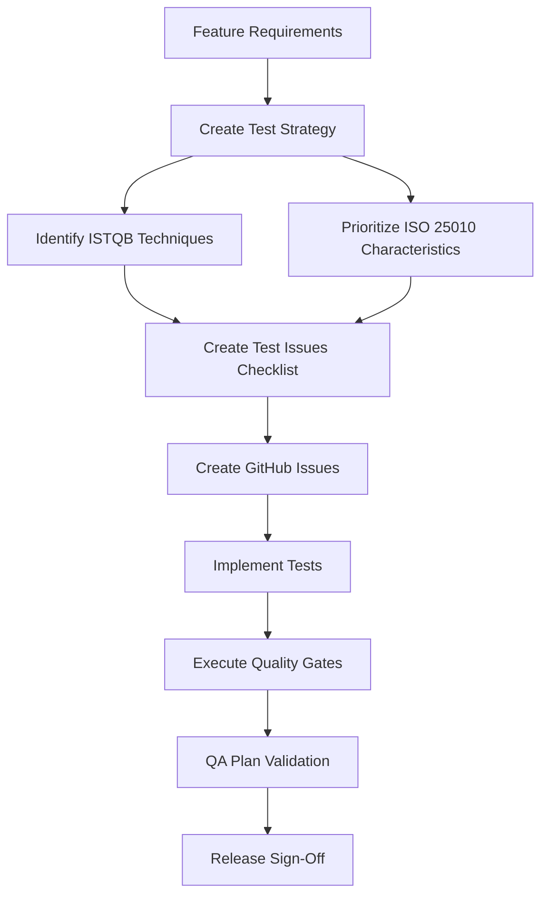
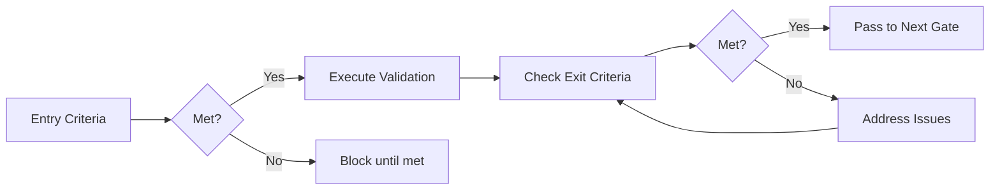

# Ways of Work - Test Planning & Quality Assurance

## Overview

This directory contains the Test Planning & Quality Assurance framework for the DevOpsDay Medellin 2025 project. The framework provides comprehensive guidance for planning, implementing, and validating quality across all features.

## Framework Philosophy

Our testing approach is built on three pillars:

1. **Industry Standards**: ISTQB test design techniques and ISO 25010 quality characteristics
2. **Risk-Based Testing**: Prioritizing testing efforts based on risk assessment
3. **Continuous Quality**: Integrating quality validation throughout the development lifecycle

## Directory Structure

```
docs/ways-of-work/
├── README.md                        # This file
├── TEST-PLANNING-FRAMEWORK.md       # Comprehensive framework documentation
└── plan/                            # Feature planning directory
    └── example-feature/             # Example feature (template)
        ├── test-strategy.md         # Test strategy document
        ├── test-issues-checklist.md # Test issues tracking
        └── qa-plan.md               # Quality assurance plan
```

## Quick Start Guide

### For New Features

When starting a new feature, follow these steps:

#### 1. Create Feature Directory

```bash
mkdir -p docs/ways-of-work/plan/{epic-name}/{feature-name}
```

#### 2. Copy Template Files

```bash
# Copy test strategy template
cp docs/ways-of-work/plan/example-feature/test-strategy.md \
   docs/ways-of-work/plan/{epic-name}/{feature-name}/test-strategy.md

# Copy test issues checklist
cp docs/ways-of-work/plan/example-feature/test-issues-checklist.md \
   docs/ways-of-work/plan/{epic-name}/{feature-name}/test-issues-checklist.md

# Copy QA plan
cp docs/ways-of-work/plan/example-feature/qa-plan.md \
   docs/ways-of-work/plan/{epic-name}/{feature-name}/qa-plan.md
```

#### 3. Customize for Your Feature

Edit each file to reflect your specific feature requirements:

- **test-strategy.md**: Define testing approach, ISTQB techniques, ISO 25010 priorities
- **test-issues-checklist.md**: List all test-related issues and track progress
- **qa-plan.md**: Define quality gates, metrics, and validation approach

#### 4. Create GitHub Issues

Use the provided issue templates:

1. Navigate to GitHub Issues → New Issue → Choose a template
2. Available templates:
   - **Test Strategy**: Overall testing approach
   - **Playwright Test Implementation**: E2E test implementation
   - **Quality Assurance**: Quality validation and sign-off

#### 5. Link Documentation to Issues

In each GitHub issue, reference the relevant documentation:

```markdown
**Related Documentation:**
- Test Strategy: `/docs/ways-of-work/plan/{epic-name}/{feature-name}/test-strategy.md`
- Test Issues Checklist: `/docs/ways-of-work/plan/{epic-name}/{feature-name}/test-issues-checklist.md`
- QA Plan: `/docs/ways-of-work/plan/{epic-name}/{feature-name}/qa-plan.md`
```

## Core Documents

### 1. Test Planning Framework

**Location**: `docs/ways-of-work/TEST-PLANNING-FRAMEWORK.md`

The comprehensive guide covering:
- ISTQB test design techniques
- ISO 25010 quality characteristics
- Test types and coverage
- Quality gates and metrics
- Best practices and workflows

**When to Use**: Read before starting any test planning to understand the framework

### 2. Test Strategy

**Location**: `docs/ways-of-work/plan/{epic}/{feature}/test-strategy.md`

Defines the testing approach for a specific feature:
- Testing scope and objectives
- ISTQB techniques application
- ISO 25010 quality assessment
- Risk assessment and mitigation
- Test environment and data strategy

**When to Use**: Create at the beginning of feature development

### 3. Test Issues Checklist

**Location**: `docs/ways-of-work/plan/{epic}/{feature}/test-issues-checklist.md`

Tracks all test-related GitHub issues:
- Test level breakdown (unit, integration, E2E)
- Test type prioritization
- Dependencies documentation
- Coverage targets and metrics
- Effort estimation

**When to Use**: Update continuously as test issues are created and completed

### 4. Quality Assurance Plan

**Location**: `docs/ways-of-work/plan/{epic}/{feature}/qa-plan.md`

Defines quality validation:
- Quality gates and checkpoints
- Entry and exit criteria
- Quality metrics and thresholds
- Defect management process
- Release readiness criteria

**When to Use**: Create after test strategy, use throughout development and for final sign-off

## GitHub Issue Templates

### Test Strategy Template

**Location**: `.github/ISSUE_TEMPLATE/test-strategy.md`

**Purpose**: Create test strategy issues for features/epics

**Labels**: `test-strategy`, `istqb`, `iso25010`, `quality-gates`

**Estimate**: 2-3 story points

**When to Use**: At the start of feature development to document testing approach

### Playwright Test Template

**Location**: `.github/ISSUE_TEMPLATE/playwright-test.md`

**Purpose**: Create E2E test implementation tasks

**Labels**: `playwright`, `e2e-test`, `quality-validation`

**Estimate**: 2-5 story points

**When to Use**: For each user workflow or component requiring E2E testing

### Quality Assurance Template

**Location**: `.github/ISSUE_TEMPLATE/quality-assurance.md`

**Purpose**: Create quality validation and sign-off issues

**Labels**: `quality-assurance`, `iso25010`, `quality-gates`

**Estimate**: 3-5 story points

**When to Use**: Near completion of feature for quality validation and go/no-go decision

## ISTQB Framework Application

### Test Design Techniques

Select appropriate techniques based on feature characteristics:

| Technique | Best For | Example Usage |
|-----------|----------|---------------|
| **Equivalence Partitioning** | Input domains | Email validation (valid/invalid formats) |
| **Boundary Value Analysis** | Input limits | Password length (min 8, max 128 chars) |
| **Decision Table Testing** | Business rules | Registration eligibility rules |
| **State Transition Testing** | State-dependent behavior | User authentication states |
| **Experience-Based Testing** | Exploratory testing | Usability and edge cases |

### Test Types

Ensure comprehensive coverage:

| Test Type | Purpose | Tools |
|-----------|---------|-------|
| **Functional** | Feature behavior | Jest, React Testing Library |
| **Non-Functional** | Performance, security, usability | Playwright, OWASP ZAP, Lighthouse |
| **Structural** | Code coverage | Jest coverage |
| **Change-Related** | Regression testing | Automated test suites |

## ISO 25010 Quality Characteristics

### Priority Assessment

For each feature, assess and prioritize quality characteristics:

| Characteristic | Questions to Ask | High Priority When... |
|----------------|------------------|----------------------|
| **Functional Suitability** | Does it work correctly? | Core business functionality |
| **Performance Efficiency** | Is it fast enough? | User-facing, real-time features |
| **Compatibility** | Does it work everywhere? | Multi-browser, multi-device |
| **Usability** | Is it easy to use? | End-user features |
| **Reliability** | Is it dependable? | Critical system functions |
| **Security** | Is it secure? | Handles sensitive data |
| **Maintainability** | Can we maintain it? | Complex systems |
| **Portability** | Can we deploy it anywhere? | Multi-environment deployment |

### Validation Approaches

Each characteristic requires specific validation:

- **Functional Suitability**: Acceptance tests, functional tests
- **Performance Efficiency**: Load tests, performance benchmarks
- **Compatibility**: Cross-browser tests, integration tests
- **Usability**: Usability tests, accessibility audits
- **Reliability**: Error handling tests, chaos engineering
- **Security**: Security tests, vulnerability scans
- **Maintainability**: Code review, static analysis
- **Portability**: Deployment tests, environment tests

## Quality Gates

### Standard Quality Gates

All features should pass through these gates:

1. **Implementation Complete**: Code done, reviewed, unit tested
2. **Integration Testing Complete**: API and service integration validated
3. **E2E Testing Complete**: User workflows validated
4. **Security Testing Complete**: No critical vulnerabilities
5. **Performance Testing Complete**: Benchmarks met
6. **Accessibility Testing Complete**: WCAG compliance
7. **Quality Validation Complete**: All criteria met, sign-off obtained

### Quality Gate Criteria

Each gate has specific entry/exit criteria defined in the QA plan.

**Example Exit Criteria:**
- Test pass rate ≥95%
- Code coverage ≥80%
- Zero critical defects
- Performance benchmarks met
- Security scan passed

## Test Coverage Targets

### Minimum Coverage Requirements

| Area | Line Coverage | Branch Coverage |
|------|---------------|-----------------|
| Critical Paths | 90% | 95% |
| Authentication/Security | 90% | 95% |
| Business Logic | 85% | 90% |
| UI Components | 80% | 85% |
| Utilities | 80% | 85% |
| Overall | 80% | 90% (critical) |

### Functional Coverage

- **Acceptance Criteria**: 100% validation
- **User Stories**: 100% test coverage
- **Critical User Paths**: 100% test coverage

### Risk Coverage

- **High-Risk Scenarios**: 100% test coverage
- **Medium-Risk Scenarios**: 90% test coverage
- **Low-Risk Scenarios**: 70% test coverage

## Workflows

### Test Planning Workflow



### Quality Gate Workflow



## Best Practices

### Test Strategy

✅ **Do:**
- Start test planning early (alongside development planning)
- Apply multiple ISTQB techniques for comprehensive coverage
- Prioritize based on risk assessment
- Document assumptions and dependencies
- Review and update as requirements evolve

❌ **Don't:**
- Wait until development is complete to plan testing
- Apply one-size-fits-all testing approach
- Ignore non-functional requirements
- Create test strategy in isolation

### Test Implementation

✅ **Do:**
- Write tests alongside feature implementation
- Follow the Page Object Model for E2E tests
- Automate regression tests
- Keep tests maintainable and readable
- Use meaningful test names and descriptions

❌ **Don't:**
- Leave all testing until the end
- Create brittle, hard-to-maintain tests
- Ignore test failures or flaky tests
- Over-rely on manual testing

### Quality Validation

✅ **Do:**
- Validate quality continuously, not just at the end
- Use measurable quality metrics
- Address quality issues promptly
- Document quality decisions and trade-offs
- Foster team ownership of quality

❌ **Don't:**
- Treat quality as solely QA's responsibility
- Skip quality gates under pressure
- Accept critical defects without proper assessment
- Ignore quality metrics trends

## Tools and Technologies

### Testing Frameworks

- **Frontend Unit Tests**: Jest, React Testing Library
- **Backend Unit Tests**: Jest
- **API Tests**: Supertest
- **E2E Tests**: Playwright
- **Performance Tests**: Lighthouse, Apache Bench
- **Security Tests**: OWASP ZAP, npm audit
- **Accessibility Tests**: axe-core, Pa11y

### CI/CD Integration

Tests run automatically in GitHub Actions:

- **Pre-commit**: Linting (local)
- **Pull Request**: Unit tests, integration tests, code coverage
- **Merge to Main**: Full regression suite, E2E tests
- **Deployment**: Smoke tests, health checks

### Reporting

- **Test Results**: GitHub Actions test reports
- **Code Coverage**: Jest coverage reports, Codecov
- **Quality Metrics**: GitHub Issues, project boards
- **Performance**: Lighthouse reports
- **Security**: OWASP ZAP reports, npm audit

## Example: User Authentication Feature

See the example feature documentation for a complete reference implementation:

- **Test Strategy**: `docs/ways-of-work/plan/example-feature/test-strategy.md`
- **Test Issues Checklist**: `docs/ways-of-work/plan/example-feature/test-issues-checklist.md`
- **QA Plan**: `docs/ways-of-work/plan/example-feature/qa-plan.md`

This example demonstrates:
- ISTQB test design techniques in practice
- ISO 25010 quality characteristics assessment
- Comprehensive test planning and validation
- Real-world test scenarios and coverage

## Success Metrics

Track these metrics to measure testing effectiveness:

### Coverage Metrics
- Code coverage: 80% line, 90% branch (critical paths)
- Functional coverage: 100% acceptance criteria
- Risk coverage: 100% high-risk scenarios

### Quality Metrics
- Defect detection rate: 95% before production
- Test automation coverage: 90%
- Quality gate compliance: 100%

### Efficiency Metrics
- Test planning time: 2 hours per feature
- Test implementation: 1 day per story point
- Quality feedback: <2 hours from test completion

## Support and Resources

### Internal Resources

- **Framework Documentation**: `TEST-PLANNING-FRAMEWORK.md`
- **Example Feature**: `plan/example-feature/`
- **Issue Templates**: `.github/ISSUE_TEMPLATE/`

### External Resources

- **ISTQB**: https://www.istqb.org/
- **ISO 25010**: ISO/IEC 25010:2011 Standard
- **Playwright**: https://playwright.dev/
- **Jest**: https://jestjs.io/

### Getting Help

- **Questions**: Open a discussion in GitHub Discussions
- **Issues**: Report problems with the framework as GitHub Issues
- **Improvements**: Submit pull requests with suggested enhancements

## Contributing

Help improve this framework:

1. **Use It**: Apply the framework to your features
2. **Provide Feedback**: Share what works and what doesn't
3. **Update Documentation**: Keep examples and guides current
4. **Share Learnings**: Document lessons learned in retrospectives
5. **Improve Templates**: Suggest template improvements

## Changelog

### Version 1.0 (Initial Release)

- Test Planning Framework documentation
- Example feature with comprehensive test documentation
- GitHub issue templates (Test Strategy, Playwright Tests, QA)
- ISTQB and ISO 25010 integration
- Quality gates and metrics framework

---

**Maintained By**: QA Team  
**Last Updated**: [Date]  
**Version**: 1.0

For questions or support, please open an issue in the repository.
